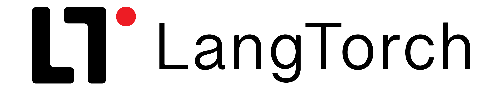

#  <div style="text-align: center;">  </div>

[](https://badge.fury.io/py/langtorch)
[](https://opensource.org/licenses/MIT)
[](https://twitter.com/AdamSobieszek)
[](https://star-history.com/#AdamSobieszek/langtorch)

[//]: # ([![]&#40;https://dcbadge.vercel.app/api/server/6adMQxSpJS?compact=true&style=flat&#41;]&#40;https://discord.gg/6adMQxSpJS&#41;)


LangTorch is a Python package that accelerates development of complex language model applications by leveraging familiar PyTorch concepts.

While existing frameworks focus on connecting language models to other services, LangTorch aims to change the way you approach creating LLM applications by introducing a unified framework for working with texts, chats, templates, LLMs, API calls and more, thanks to TextTensors — "torch Tensors but with text data as entries" — offering a flexible way to structure and transform text data and embeddings with seamless parallelization. 

## Installation

```bash
pip install langtorch
```

## Overview

- **No useless classes**: Instead of providing wrapper classes for users to memorize, LangTorch introduces fewer, more flexible objects that, while governed by simple rules, enable all kinds of text formatting, templating and LLM operations.

- **Unified Approach**: TextTensors let you structure geometrically and handle in parallel text entries that without any additional classes can represent strings, documents, prompt templates, completion dictionaries, chat histories, markup languages, chunks, retrieval queries, tokens, embeddings...

- **You probably already know LangTorch**: LangTorch components subclass their numerical PyTorch counterparts, which lets users apply their existing coding skills to building novel LLM app architectures. This includes:

- **TextModules** - a subclass of torch.nn.Module working on TextTensors and able to perform template completions, prompt injections, local and API LLM inference, create embedding, performing operations on embeddings in retrieval and so on.

- Honestly just go to https://langtorch.org there is much more information there!

## Code Examples

The examples are introduced on the main documentation page, but even without much introduction you can see how compact some pretty complex operations can be implemented with LangTorch.

### TextTensors act both as texts and embeddings

```python  
import torch  
  
tensor1 = TextTensor([["Yes"], ["No"]])  
tensor2 = TextTensor(["Yeah", "Nope", "Yup", "Non"])  
  
print(torch.cosine_similarity(tensor1, tensor2))
print("Content:\n", tensor1)
```

```    title="Output:"
tensor([[0.6923, 0.6644, 0.6317, 0.5749],
	    [0.5457, 0.7728, 0.5387, 0.7036]])
Content:
[[Yes], 
 [No ]]
```


LangTorch code looks weird at first, why? Since the utility of Tensors, as used in Torch, relies on their ability to calculate simultaneously products of several weights. The corresponding, and most used, feature in LangTorch allows several prompts to be formatted on several inputs, by defining the multiplication of text entries `text1*text2` similarly to `text1.format(**text2)`


### Chains

The multiplication operation lets us build chains of TextModules with a simple `torch.nn.Sequential`:

```python
chain = torch.nn.Sequential(
    TextModule("Translate this equation to natural language: {}"),
    CoT,
    OpenAI("gpt-4")
    TextModule("Calculate the described quantity: {}"),
    OpenAI("gpt-4", T=0)
)

input_tensor = TextTensor(["170*32 =", "4*20 =", "123*45/10 =", "2**10*5 ="])
output_tensor = chain(input_tensor)
```


### Retrieval & RAG from scratch

The code below is a complete working implementation of a cosine similarity-based retriever:

```python
class Retriever(TextModule):  
    def __init__(self, documents: TextTensor):  
        super().__init__()  
        self.documents = TextTensor(documents).view(-1)  
  
    def forward(self, query: TextTensor, k: int = 5):  
        cos_sim = torch.cosine_similarity(self.documents, query.reshape(1))  
        return self.documents[cos_sim.topk(k)]
         
```
```python title="Usage:"
retriever = Retriever(open("doc.txt", "r").readlines())
query = TextTensor("How to build a retriever?")

print(retriever(query))
```

We can now compose this module with a TextModule making LLM calls to get a custom Retrieval Augmented Generation pipeline:

```python
class RAG(TextModule):  
    def __init__(self, documents: TextTensor, *args, **kwargs):  
        super().__init__(*args, **kwargs)  
        self.retriever = Retriever(documents)  
  
    def forward(self, user_message: TextTensor, k: int = 5):  
        retrieved_context = self.retriever(user_message, k) +"\n"  
        user_message = user_message + "\nCONTEXT:\n" + retrieved_context.sum()  
        return super().forward(user_message)
```

```python title="Usage:"
rag_chat = RAG(paragraphs,  
			   prompt="Use the context to answer the following user query: ",
			   activation="gpt-3.5-turbo")

assistant_response = rag_chat(user_query)
```

Go to https://langtorch.org to understand these RAGs-to-riches code shenanigans.

## License

LangTorch is MIT licensed. See the [LICENSE](#) file for details.
